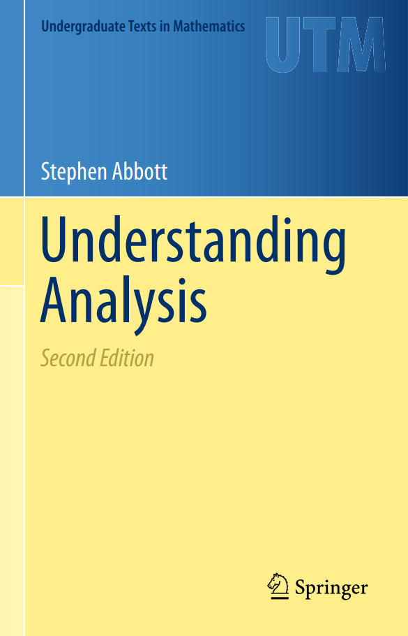

### Course Description
2026년도 봄학기에 DGIST에서 수강한 "학부생을 위한 해석학 개론" 강의를 정리한 Lecture Note입니다.  
안흥주교수님께서 강의하셨으며, 과제로 교수님의 강의노트를 기반하여 수업에서 다룬 주제들을 정리하였습니다.

### Main Textbook
Understanding Analysis, 2nd edition | Stephen Abbott

## Chapters
